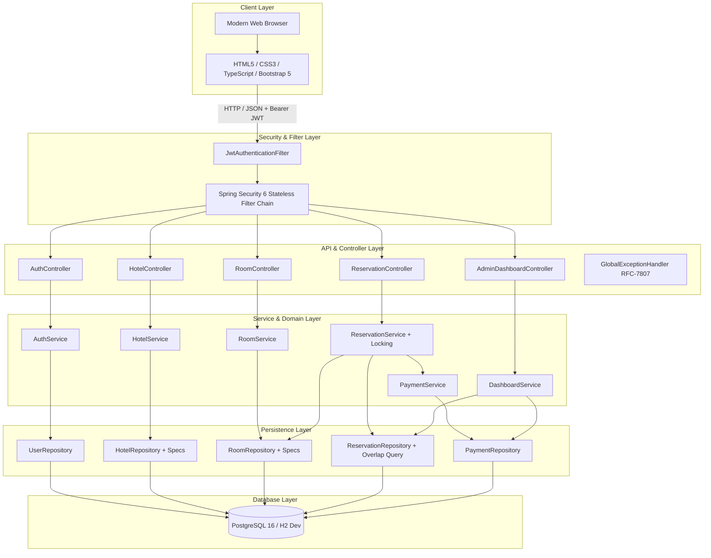
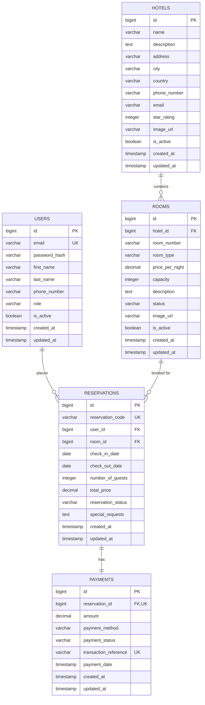
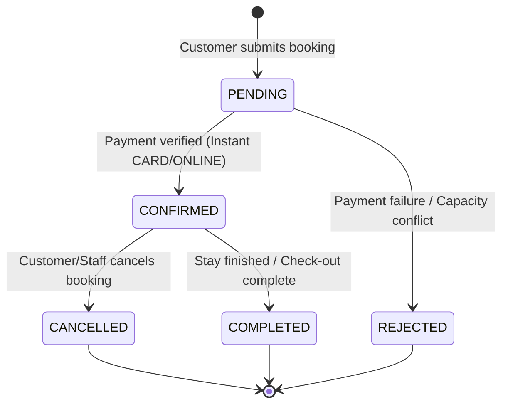

# 🏨 Aura Stays — Enterprise Hotel Reservation System

[](https://www.oracle.com/java/)
[](https://spring.io/projects/spring-boot)
[](https://spring.io/projects/spring-security)
[](https://www.postgresql.org/)
[](https://www.typescriptlang.org/)
[](https://getbootstrap.com/)
[](http://localhost:8080/swagger-ui.html)

A production-grade, enterprise Full-Stack **Hotel Reservation System** built with **Java 21**, **Spring Boot 3**, **Spring Security & Stateless JWT**, **PostgreSQL**, and a responsive **HTML5/TypeScript/Bootstrap 5** frontend with custom luxury glassmorphism design tokens.

---

## 📑 Table of Contents

- [Key Features](#-key-features)
- [System Architecture](#-system-architecture)
- [Database ERD & Domain Model](#-database-erd--domain-model)
- [Concurrency & Anti-Double-Booking Strategy](#-concurrency--anti-double-booking-strategy)
- [Reservation Lifecycle](#-reservation-lifecycle)
- [Role-Based Access Control (RBAC)](#-role-based-access-control-rbac)
- [REST API Matrix](#-rest-api-matrix)
- [Tech Stack](#-tech-stack)
- [Getting Started](#-getting-started)
  - [Prerequisites](#prerequisites)
  - [Running the Backend](#running-the-backend)
  - [Running the Frontend](#running-the-frontend)
- [Default Demo Credentials](#-default-demo-credentials)
- [Running Automated Tests](#-running-automated-tests)
- [API Documentation (Swagger)](#-api-documentation-swagger)
- [Project Directory Structure](#-project-directory-structure)

---

## 🌟 Key Features

### 👤 Customer Features
- **Discovery & Search**: Multi-criteria hotel search by city, star rating, keyword name, and price brackets.
- **Real-Time Room Availability**: Dynamic date range validation (`checkInDate`, `checkOutDate`) and guest capacity limits.
- **Seamless Booking Experience**: Instant reservation generation with unique booking tracking codes (`HTL-YYYY-XXXXXX`).
- **Simulated Payment Gateway**: Card, Cash, and Online checkout simulation with instant transaction reference generation (`TXN-METHOD-TIMESTAMP-UUID`).
- **Customer Portal**: My Bookings dashboard, live booking status badges, cancellation with penalty rules, printable receipts, and profile management.

### 🛎️ Hotel Staff Features
- **Operations Console**: View active guest reservations, check-in guests, mark stays as completed, and process cancellations.
- **Room Status Management**: Update room statuses (`AVAILABLE`, `OCCUPIED`, `MAINTENANCE`, `RESERVED`) in real time.

### 👑 Administrator Features
- **Executive Analytics Dashboard**: Real-time revenue metrics, total bookings, confirmed/pending counts, occupancy rates, and recent activity logs.
- **Property & Room Management**: Create, edit, and manage hotels and room inventory across all locations.
- **User Management**: View and manage customer and staff accounts with RBAC controls.

---

## 🏛️ System Architecture



---

## 🗄️ Database ERD & Domain Model



---

## 🔒 Concurrency & Anti-Double-Booking Strategy

To guarantee **zero double-bookings** even under high concurrent load:

1. **Transactional Isolation**: Reservation creation is wrapped in `@Transactional(isolation = Isolation.READ_COMMITTED)`.
2. **Pessimistic / Atomic Room Check**: The room row is fetched and verified active.
3. **Active Date Overlap Interception Query**:
   ```sql
   SELECT r FROM Reservation r
   WHERE r.room.id = :roomId
     AND r.reservationStatus IN ('PENDING', 'CONFIRMED')
     AND (r.checkInDate < :checkOutDate AND r.checkOutDate > :checkInDate)
   ```
4. **Conflict Exception**: If an overlapping reservation is found, the transaction immediately rolls back and throws `DuplicateReservationException`, returning a standard **HTTP 409 Conflict** with an informative error payload to the client.

---

## 🔄 Reservation Lifecycle



---

## 🛡️ Role-Based Access Control (RBAC)

| Role | Permissions |
| :--- | :--- |
| **`CUSTOMER`** | Search hotels & rooms, book reservations, cancel own bookings, view own receipts and profile. |
| **`STAFF`** | View all reservations, check-in guests, update room maintenance statuses, assist booking changes. |
| **`ADMIN`** | Full executive access: Revenue analytics dashboard, create/modify hotels & rooms, manage users. |

---

## 📡 REST API Matrix

### 🔐 Authentication (`/api/auth`)
| Method | Endpoint | Description | Access |
| :--- | :--- | :--- | :--- |
| `POST` | `/api/auth/register` | Register new customer account | Public |
| `POST` | `/api/auth/login` | Authenticate and obtain JWT token | Public |
| `GET` | `/api/auth/me` | Fetch authenticated user profile | Authenticated |

### 🏨 Hotels (`/api/hotels`)
| Method | Endpoint | Description | Access |
| :--- | :--- | :--- | :--- |
| `GET` | `/api/hotels` | Paginated search with city, rating, price filters | Public |
| `GET` | `/api/hotels/cities` | List unique cities with hotels | Public |
| `GET` | `/api/hotels/{id}` | Get hotel details by ID | Public |
| `POST` | `/api/hotels` | Create new hotel property | `ADMIN` |
| `PUT` | `/api/hotels/{id}` | Update hotel details | `ADMIN` |
| `DELETE`| `/api/hotels/{id}` | Soft-delete hotel property | `ADMIN` |

### 🛏️ Rooms (`/api/rooms`)
| Method | Endpoint | Description | Access |
| :--- | :--- | :--- | :--- |
| `GET` | `/api/rooms/available` | Search available rooms by date & guests | Public |
| `GET` | `/api/rooms/hotel/{hotelId}` | Get all rooms for a hotel | Public |
| `GET` | `/api/rooms/{id}` | Get room details by ID | Public |
| `POST` | `/api/rooms` | Create new room in hotel | `ADMIN`, `STAFF` |
| `PUT` | `/api/rooms/{id}` | Update room details & pricing | `ADMIN`, `STAFF` |
| `PATCH`| `/api/rooms/{id}/status` | Update room status | `ADMIN`, `STAFF` |
| `DELETE`| `/api/rooms/{id}` | Soft-delete room | `ADMIN` |

### 📅 Reservations (`/api/reservations`)
| Method | Endpoint | Description | Access |
| :--- | :--- | :--- | :--- |
| `POST` | `/api/reservations` | Create reservation with anti-overlap guard | `CUSTOMER`, `STAFF`, `ADMIN` |
| `GET` | `/api/reservations/my` | Get current customer's reservations | `CUSTOMER`, `STAFF`, `ADMIN` |
| `GET` | `/api/reservations/code/{code}`| Get reservation receipt by code | Authenticated |
| `GET` | `/api/reservations/{id}` | Get reservation by ID | Authenticated |
| `GET` | `/api/reservations` | Search all reservations (staff filter) | `STAFF`, `ADMIN` |
| `PATCH`| `/api/reservations/{id}/cancel`| Cancel reservation with policy check | Authenticated |
| `PATCH`| `/api/reservations/{id}/status`| Update reservation status | `STAFF`, `ADMIN` |

### 📊 Admin Dashboard (`/api/admin/dashboard`)
| Method | Endpoint | Description | Access |
| :--- | :--- | :--- | :--- |
| `GET` | `/api/admin/dashboard/statistics` | Real-time KPIs, revenue & occupancy | `ADMIN` |
| `GET` | `/api/admin/dashboard/recent-activity` | Latest reservations & payments stream | `ADMIN` |

---

## 💻 Tech Stack

- **Backend**: Java 21, Spring Boot 3.4.3 (Web, Data JPA, Security, Validation, DevTools)
- **Security**: JJWT (Java JWT 0.12.6) Stateless Auth, BCrypt Password Encoding, CORS Filter
- **Database**: PostgreSQL 16 (Production) & H2 in-memory (Development/Testing)
- **API Documentation**: Springdoc OpenAPI 2.8.5 / Swagger UI
- **Frontend**: HTML5, Vanilla Modern CSS (Glassmorphism, Gold/Navy Design Tokens), TypeScript 5.7, Bootstrap 5.3, FontAwesome 6
- **Build Tools**: Maven 3.9+ (`mvnw`), `esbuild` for TypeScript bundle generation

---

## 🚀 Getting Started

### Prerequisites
- **JDK 21+** installed (`java -version`)
- **Node.js 18+** & `npm` (for frontend static server and TypeScript build)
- Optional: **PostgreSQL 16** (if running with `prod` profile)

---

### 🚀 Unified Single-Localhost Run (Frontend + Backend Together)

The frontend assets are integrated directly into Spring Boot. Running the backend serves **both** the full frontend web application and the REST API from a single port (`8080`):

1. **(Optional) Rebuild Frontend Assets if modified**:
   ```bash
   cd frontend
   npm install
   npm run build
   cd ..
   ```

2. **Start the Unified Application**:
   ```bash
   cd backend

   # Windows
   .\mvnw.cmd spring-boot:run

   # Linux / macOS
   ./mvnw spring-boot:run
   ```

3. **Open in Browser**:
   - 🌐 **Web Application**: [`http://localhost:8080`](http://localhost:8080)
   - 📖 **Swagger API Docs**: [`http://localhost:8080/swagger-ui.html`](http://localhost:8080/swagger-ui.html)
   - 🗄️ **H2 Database Console**: [`http://localhost:8080/h2-console`](http://localhost:8080/h2-console) (JDBC URL: `jdbc:h2:mem:hoteldb`, User: `sa`, Password: *(blank)*)

---

## 🔑 Default Demo Credentials

The system automatically initializes test accounts on startup with pre-hashed BCrypt passwords:

| Role | Email | Password | Pre-loaded Access |
| :--- | :--- | :--- | :--- |
| **Administrator** | `admin@grandhotel.com` | `password123` | Executive Dashboard, Hotel & Room CRUD, User Management |
| **Staff Member** | `sarah.staff@grandhotel.com` | `password123` | Guest Check-in, Reservation Statuses, Room Status Updates |
| **Customer** | `john.doe@example.com` | `password123` | Bookings, My Reservations, Room Booking Flow |

*(Quick demo login buttons are also provided on `login.html` for one-click testing).*

---

## 🧪 Running Automated Tests

Run the full JUnit 5 & Mockito test suite via Maven:

```bash
cd backend
.\mvnw.cmd test
```

### Test Suite Summary:
- `AuthServiceTest`: Login authentication, JWT token generation, duplicate registration rejection.
- `ReservationServiceTest`: Reservation creation, server-side price calculation, capacity validation, anti-double-booking collision detection.
- `HotelServiceTest`: Multi-criteria search filters, hotel creation, not-found handling.
- `RoomServiceTest`: Availability date queries, room capacity checks, room status updates.

---

## 📖 API Documentation (Swagger)

When the backend is running, open the interactive Swagger UI:

👉 **[http://localhost:8080/swagger-ui.html](http://localhost:8080/swagger-ui.html)**

Or download the OpenAPI 3.0 specification:
👉 **[http://localhost:8080/v3/api-docs](http://localhost:8080/v3/api-docs)**

---

## 📁 Project Directory Structure

```text
Hotel-Reservation-System/
├── backend/
│   ├── src/
│   │   ├── main/
│   │   │   ├── java/com/example/hotelreservation/
│   │   │   │   ├── config/             # SecurityConfig, WebConfig, OpenApiConfig, DataInitializer
│   │   │   │   ├── controller/         # Auth, Hotel, Room, Reservation, User, Admin controllers
│   │   │   │   ├── dto/                # Request & Response contracts with Jakarta Validation
│   │   │   │   ├── entity/             # User, Hotel, Room, Reservation, Payment JPA entities
│   │   │   │   ├── enums/              # Role, RoomType, RoomStatus, ReservationStatus, PaymentMethod
│   │   │   │   ├── exception/          # Custom exceptions & RFC-7807 GlobalExceptionHandler
│   │   │   │   ├── mapper/             # Entity <-> DTO mappers
│   │   │   │   ├── repository/         # Spring Data JPA repositories & JPQL locking queries
│   │   │   │   ├── security/           # JwtTokenProvider, JwtFilter, CustomUserDetailsService
│   │   │   │   ├── service/            # Core business logic services
│   │   │   │   └── specification/      # Dynamic JPA Criteria specifications
│   │   │   └── resources/
│   │   │       ├── application.properties
│   │   │       ├── application-dev.properties
│   │   │       ├── application-prod.properties
│   │   │       └── schema-postgresql.sql
│   │   └── test/                       # JUnit 5 & Mockito unit tests
│   └── pom.xml
│
├── frontend/
│   ├── css/
│   │   └── styles.css                  # Luxury Gold/Navy design system tokens & glassmorphism
│   ├── dist/                           # Compiled & bundled JavaScript pages
│   ├── src/
│   │   ├── pages/                      # Landing, Hotels, Details, Booking, Confirmation, Admin, etc.
│   │   ├── services/                   # Typed API service clients with Axios/Fetch
│   │   ├── types/                      # TypeScript domain definitions
│   │   └── utils/                      # Auth guards, formatters, toast notification manager
│   ├── index.html                      # Luxury Landing Page
│   ├── hotels.html                     # Multi-criteria Filter & Hotel Directory
│   ├── hotel-details.html              # Hotel Overview & Room Availability Picker
│   ├── reservation.html                # Booking Checkout & Payment Simulation
│   ├── confirmation.html               # Booking Receipt & Print Voucher
│   ├── my-reservations.html            # Customer Bookings Dashboard
│   ├── profile.html                    # User Profile Settings
│   ├── login.html                      # Sign In with Quick Demo Buttons
│   ├── register.html                   # Account Registration
│   ├── admin.html                      # Executive Admin & Operations Dashboard
│   ├── package.json
│   └── tsconfig.json
│
├── .env.example
└── README.md
```

---

## ⚖️ License

Distributed under the **MIT License**. See `LICENSE` for more information.
